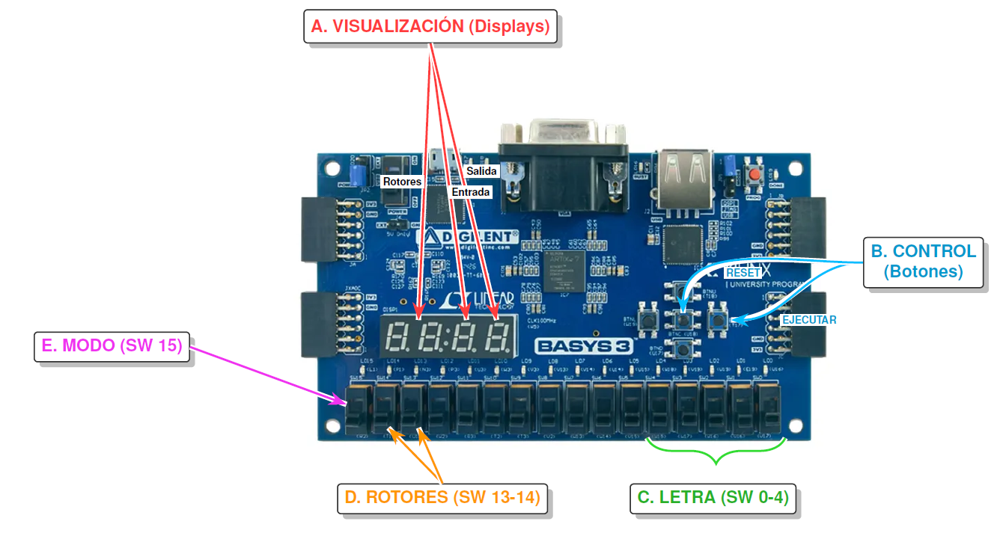

# 🔐 FPGA Enigma Machine
### Implementación Hardware VHDL sobre Artix-7

 

**Rescatando la ingeniería de 1940 mediante lógica digital moderna.**
Este proyecto no es una simple simulación; es una reconstrucción física de los rotores y circuitos de la Enigma, traducidos a puertas lógicas para operar en tiempo real.

[Explorar RTL](#arquitectura) • [Manual de Uso](#manual) • [Ver Autores](#creditos)

 
<em>Figura 1: Nuestro diseño conceptual del flujo de datos (Datapath).</em>

---

## 📋 La Misión del Proyecto

El objetivo fue replicar la **Máquina Enigma** utilizando hardware reconfigurable. En lugar de escribir código que se ejecuta secuencialmente (como en C o Python), hemos diseñado un circuito digital que **existe físicamente** dentro de la FPGA.

Separamos estrictamente el diseño en dos mundos: el **Datapath** (que transporta y transforma las letras) y la **Lógica de Control** (que decide cuándo y cómo ocurren las cosas).

### ¿Qué lo hace especial?
* ⚙️ **Mecánica Virtual:** Hemos recreado el "clic" físico de los rotores y el trinquete usando contadores y lógica de estado.
* 🧮 **Aritmética Modular:** Implementamos aritmética modular (`MOD 26`) pura para calcular los cifrados sin procesador.
* 🛡️ **Fiabilidad:** Incluye un sistema de *debouncing* de 50ms para que los botones de la placa se sientan firmes y precisos.
* * 📟 **Visualización:** Salida multiplexada en 7-segmentos.

---

## 🏗️ Arquitectura del Sistema

Todo el diseño se ha sintetizado y probado en una placa **Basys 3 (Artix-7)**. Aquí explicamos cómo funciona la máquina:

### 1. Jerarquía Top-Level
Es el módulo que conecta todo. Une nuestros periféricos (botones, switches) con la lógica interna, actuando como la placa base del sistema.

### 2. Unidad de Control
Aquí es donde reside la inteligencia. Esta Máquina de Estados Finitos (FSM) orquesta todo el proceso: detecta tu pulsación, espera a que la señal se estabilice y ordena a los rotores que giren.

> *Como todo buen diseño, este nació en papel. Abajo mostramos el boceto original de los estados y su traducción final a hardware:*

  
  

### 3. ALU Modular
Este módulo constituye el núcleo de ejecución del sistema. Su función principal es emular el cableado físico de los rotores originales mediante el uso de aritmética modular, aplicando operaciones de suma y resta de offsets para transformar la señal de entrada.
> `Salida = (Entrada + Offset_Rotor) mod 26`

La implementación se basa en un diseño combinacional que garantiza que la sustitución de caracteres sea instantánea una vez que los registros de los rotores están estables.

---

## 🎮 Manual de Operación

A continuación se muestra el mapa de interfaz de la placa. **Es recomendable realizar un RESET al encender la FPGA.**

> 📸 **Nota:** Guía visual para la configuración física en la Basys 3.

    

### Tabla de Referencia Rápida

| Componente | Función | Detalles |
| :--- | :--- | :--- |
| **A. Displays** | Visualización | **[ Rotores \| Entrada \| Salida ]** |
| **B. Botones** | Control | `Centro`: Reset Total / `Derecho`: Cifrar Letra |
| **C. Switches [0-4]** | Entrada Datos | Selección de letra en binario (Ver tabla abajo). |
| **D. Switches [13-14]** | Config. Rotores | Selección de rodillo/tabla interna. |
| **E. Switch [15]** | Modo | ⬇️ Cifrar / ⬆️ Descifrar |

<strong>🔻 Desplegar Tabla de Códigos Binarios (A-Z)</strong>

 

| Letra | Binario | Letra | Binario | Letra | Binario |
| :---: | :---: | :---: | :---: | :---: | :---: |
| **A** | 00000 | **J** | 01001 | **S** | 10010 |
| **B** | 00001 | **K** | 01010 | **T** | 10011 |
| **C** | 00010 | **L** | 01011 | **U** | 10100 |
| **D** | 00011 | **M** | 01100 | **V** | 10101 |
| **E** | 00100 | **N** | 01101 | **W** | 10110 |
| **F** | 00101 | **O** | 01110 | **X** | 10111 |
| **G** | 00110 | **P** | 01111 | **Y** | 11000 |
| **H** | 00111 | **Q** | 10000 | **Z** | 11001 |
| **I** | 01000 | **R** | 10001 | | |

---

## 👥 Colaboradores

Proyecto desarrollado para la asignatura de [**Tecnología de Computadores**](https://www.ucm.es/estudios/grado-ingenieriadecomputadores-plan-803217) de la [**UCM**](https://www.ucm.es/).

| [ <b>Juan Pastrana García</b>](https://github.com/GustoffotsuG) | [ <b>Omar Ouahri Vigil</b>](https://github.com/theomaaroo) |
| :---: | :---: |

