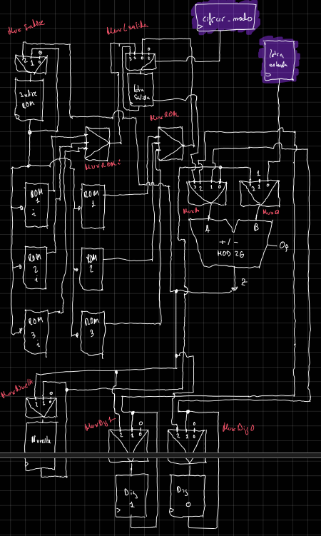
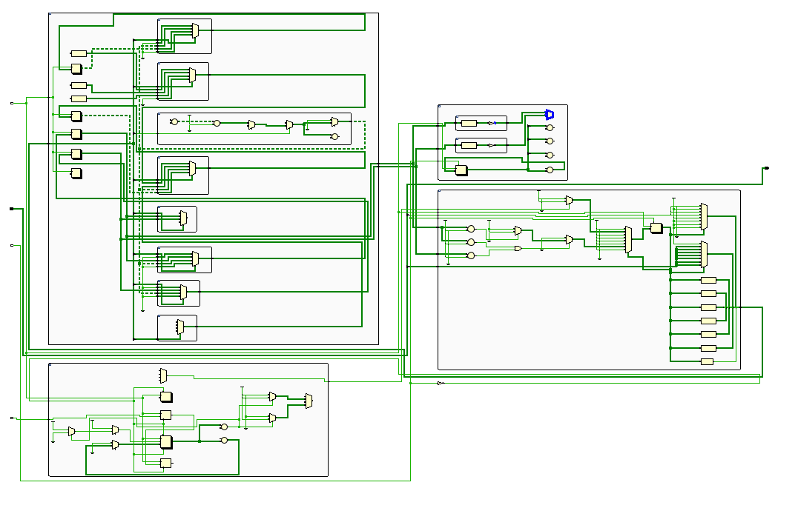
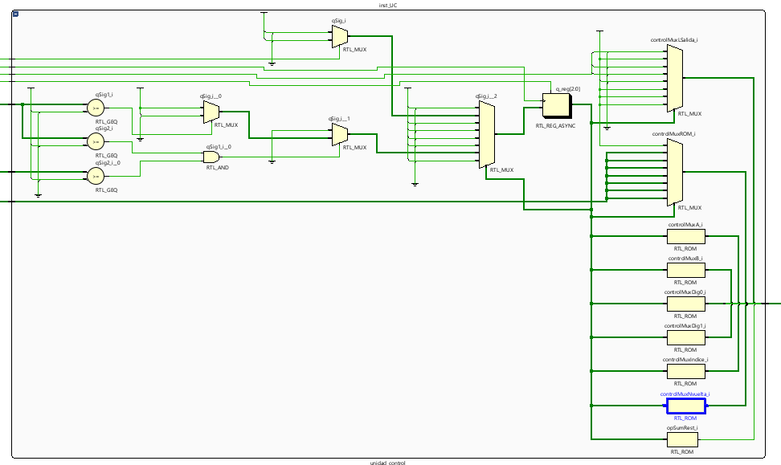
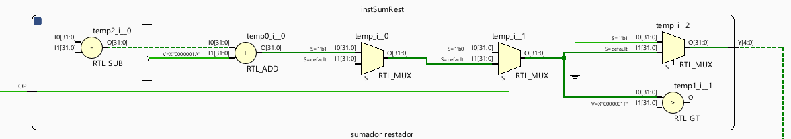

# 🔐 FPGA Enigma Machine
### Implementación Hardware VHDL sobre Artix-7

 

**Una reconstrucción digital de la criptografía electromecánica de la Segunda Guerra Mundial.** No es una simulación por software: es hardware dedicado configurado para emular rotores, reflectores y lógica de cifrado.

[Explorar RTL](#arquitectura) • [Manual de Uso](#manual) • [Ver Autores](#creditos)

 
<em>Figura 1: Diseño conceptual original del flujo de datos (Datapath).</em>

---

## 📋 Resumen del Proyecto

Este proyecto implementa una **Máquina Enigma** funcional utilizando lógica digital pura. El sistema ha sido diseñado separando estrictamente la ruta de datos (Datapath) de la lógica de control (FSM), permitiendo un cifrado polialfabético en tiempo real.

### Características Principales
* ⚙️ **Mecánica Virtual:** Simulación del movimiento físico de los rotores (trinquete).
* 🧮 **Aritmética Modular:** ALU dedicada para operaciones `MOD 26`.
* 🛡️ **Fiabilidad:** Debouncing hardware de 50ms para pulsadores.
* 📟 **Visualización:** Salida multiplexada en 7-segmentos.

---

## 🏗️ Arquitectura Hardware

El diseño se ha sintetizado en una FPGA **Xilinx Artix-7** (Basys 3). A continuación se detallan los bloques críticos generados por Vivado.

### 1. Jerarquía Top-Level
Integra la Unidad de Control, el Datapath y los controladores de periféricos.

### 2. Unidad de Control (El Cerebro)
Una máquina de estados finitos (Moore) gestiona la secuencia de cifrado.
* **Estados S2-S3:** Cálculo matemático de la letra.
* **Estados S4-S6:** Lógica mecánica (decisión de giro de rotores).

### 3. ALU Modular (El Corazón)
Sustituye el cableado físico de los rotores mediante sumas y restas de offsets.
> `Salida = (Entrada + Offset_Rotor) mod 26`

---

## 🎮 Manual de Operación

### Mapa de Controles (Basys 3)

| Componente | Etiqueta | Función |
| :--- | :--- | :--- |
| **SW [4:0]** | `Entrada` | Selección de letra en binario (**A**=`00000` ... **Z**=`11001`). |
| **SW [14:13]** | `Rotor` | Configuración del patrón de cableado interno. |
| **SW [15]** | `Modo` | ⬇️ **Cifrar** / ⬆️ **Descifrar**. |
| **BTN Center** | `RESET` | **Obligatorio al inicio.** Reinicia rotores a `00`. |
| **BTN Right** | `CIFRAR` | Ejecuta el ciclo de cifrado y avanza el mecanismo. |

### Guía Rápida de Uso

1.  **Reset:** Pulsa el botón central. El display debe mostrar `00` en los dígitos de la izquierda.
2.  **Configura:** Elige modo Cifrar (SW15 abajo) y selecciona una letra con los switches derechos.
3.  **Ejecuta:** Pulsa el botón derecho.
4.  **Resultado:**
    * El **Dígito 0** (derecha) muestra la letra cifrada.
    * Los **Dígitos 3-2** (izquierda) muestran cómo han girado los rotores.

---

## 🛠️ Tecnologías Utilizadas

* **Lenguaje:** VHDL-93
* **IDE:** Xilinx Vivado 2023.x
* **Hardware:** Digilent Basys 3 (Artix-7 XC7A35T)
* **Simulación:** Vivado Logic Analyzer

---

## 👥 Créditos

Este proyecto fue diseñado, codificado y documentado por estudiantes de **Ingeniería de Computadores**:

| [**Juan Pastrana García**](https://github.com/GustoffotsuG) | [**Omar Ouahri Vigil**](https://github.com/theomaaroo) |
| :---: | :---: |
| Diseño Datapath & RTL | Lógica de Control & FSM |

